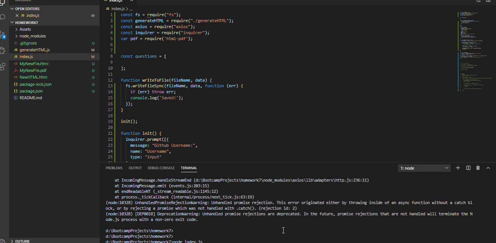

# Unit 09 Node.js and ES6+ Homework: Developer Profile Generator

Create a command-line application that dynamically generates a PDF profile from a GitHub username. The application will be invoked with the following command:

```sh
node index.js
```

The user will be prompted for a favorite color, which will be used as the background color for cards.

The PDF will be populated with the following:

* Profile image
* User name
* Links to the following:
  * User location via Google Maps
  * User GitHub profile
  * User blog
* User bio
* Number of public repositories
* Number of followers
* Number of GitHub stars
* Number of users following

Following the [common templates for user stories](https://en.wikipedia.org/wiki/User_story#Common_templates), we can frame this challenge as follows:

```
AS A product manager

I WANT a developer profile generator

SO THAT I can easily prepare reports for stakeholders
```

Refer to the [design mockup](./Assets/09-NodeJS-homework-demo.pdf).

## Business Context

When preparing a report for stakeholders, it is important to have up-to-date information about members of the development team. Rather than navigating to each team member's GitHub profile, a command-line application will allow for quick and easy generation of profiles in PDF format.

## Minimum Requirements

* Functional, deployed application.

* GitHub repository with a unique name and a README describing project.

* The application generates a PDF resume from the user provided GitHub profile.

* The generated resume includes a bio image from the user's GitHub profile.

* The generated resume includes the user's location and a link to their GitHub profile.

* The generated resume includes the number of: public repositories, followers, GitHub stars and following count.

* The background color of the generated PDF matches the color that the user provides.

```
GIVEN the developer has a GitHub profile

WHEN prompted for the developer's GitHub username and favorite color

THEN a PDF profile is generated
```
- - -

## Commit Early and Often

One of the most important skills to master as a web developer is version control. Building the habit of committing via Git is important for two reasons:

* Your commit history is a signal to employers that you are actively working on projects and learning new skills.

* Your commit history allows you to revert your code base in the event that you need to return to a previous state.

Follow these guidelines for committing:

* Make single-purpose commits for related changes to ensure a clean, manageable history. If you are fixing two issues, make two commits.

* Write descriptive, meaningful commit messages so that you and anyone else looking at your repository can easily understand its history.

* Don't commit half-done work, for the sake of your collaborators (and your future self!).

* Test your application before you commit to ensure functionality at every step in the development process.

We would like you to have more than 200 commits by graduation, so commit early and often!

## Submission on BCS

You are required to submit the following:

* An animated GIF demonstrating the app functionality

* A generated PDF of your GitHub profile

* The URL of the GitHub repository

Gif:



- - -
© 2019 Trilogy Education Services, a 2U, Inc. brand. All Rights Reserved.
